# Sokoban

A Sokoban puzzle game for Android, written in Kotlin with Jetpack Compose.
Seventy hand-designed levels in seven worlds, every one verified solvable.

<p align="center">
  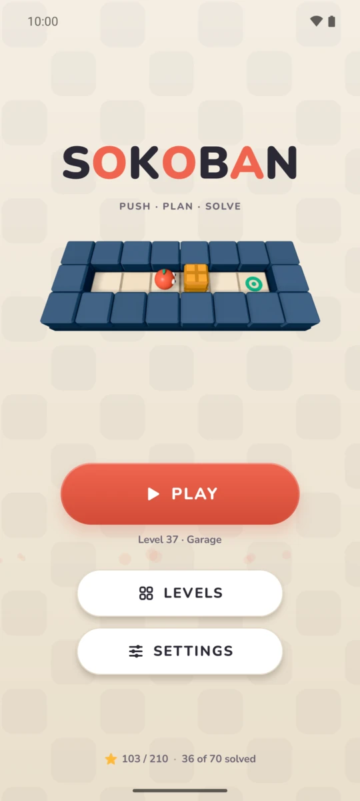
  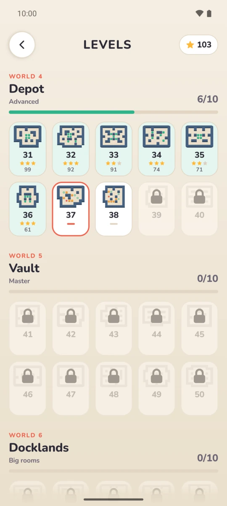
  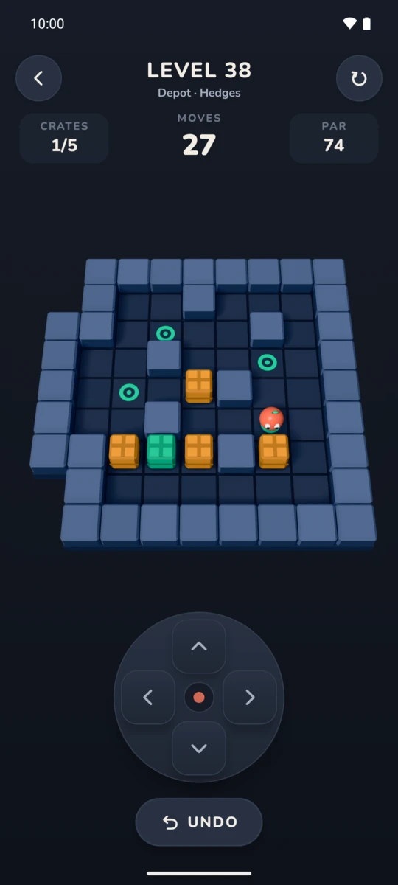
  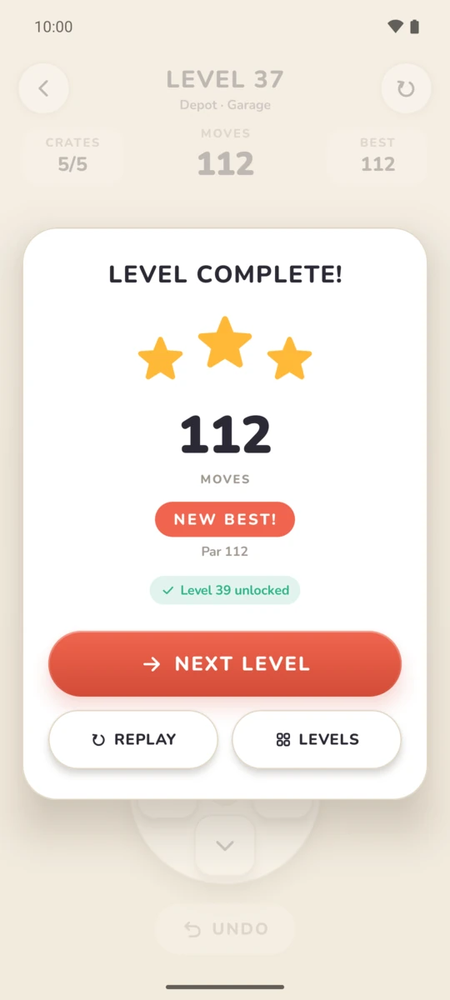
</p>

## Build

Requirements: Android SDK 37 and JDK 17 or newer.

```bash
./gradlew test            # engine and app unit tests
./gradlew assembleDebug   # app/build/outputs/apk/debug/
./gradlew :app:lintDebug
```

## Release

```bash
./gradlew bundleRelease   # app/build/outputs/bundle/release/app-release.aab (for Google Play)
./gradlew assembleRelease # app/build/outputs/apk/release/app-release.apk
```

Both are minified with R8. They are signed with your upload key when one is
configured, and with the debug key otherwise (fine for testing; Google Play
refuses it). Keys and their passwords never go into git.

Create an upload key once, and keep a backup of it:

```bash
keytool -genkeypair -keystore ~/keys/sokoban-upload.jks -alias upload \
    -keyalg RSA -keysize 4096 -validity 10000
```

Then either write `keystore.properties` at the project root (git-ignored):

```properties
storeFile=/home/you/keys/sokoban-upload.jks
storePassword=…
keyAlias=upload
keyPassword=…
```

or set `SOKOBAN_KEYSTORE`, `SOKOBAN_KEYSTORE_PASSWORD`, `SOKOBAN_KEY_ALIAS` and
`SOKOBAN_KEY_PASSWORD` (for a build server). A relative `storeFile` is resolved
from the project root. A partial configuration fails the build instead of
falling back to the debug key.

Raise `versionCode` in `app/build.gradle.kts` for every upload.

The store listing (texts, icon, feature graphic, screenshots) is in
`fastlane/metadata/android/en-US/`, with the Khmer texts and screenshots in `km-KH/`;
`docs/play-console.md` has the answers for
Play Console's *App content* section and `docs/privacy-policy.md` the privacy
policy to host.

## Layout

| Module  | Contents |
|---------|----------|
| `:core` | Pure Kotlin/JVM, no Android dependency: rules (`GameEngine`), immutable `GameState` with unlimited undo, level parser and validator, deadlock detection, campaign progress rules, and the level pack. |
| `:app`  | The Compose app: the board and character drawn in 2D (Canvas) or 3D (Filament), D-pad, swipe, tap-to-walk and keyboard input, screens, synthesised sound, haptics, DataStore persistence. |

Data flows one way: `GameEngine` → `GameState` → `GameViewModel` (`StateFlow`) → Compose.

## 3D board

| 2D | 3D | Settings |
|:--:|:--:|:--:|
| 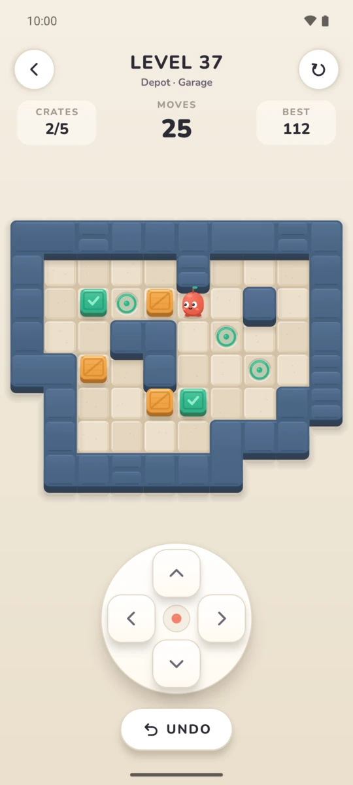 | 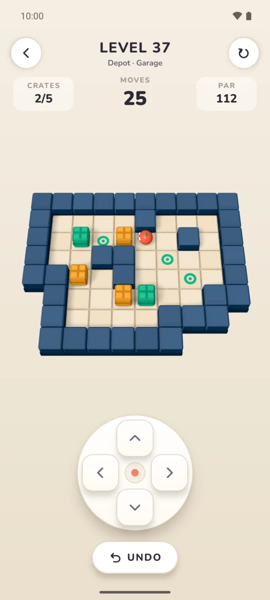 | 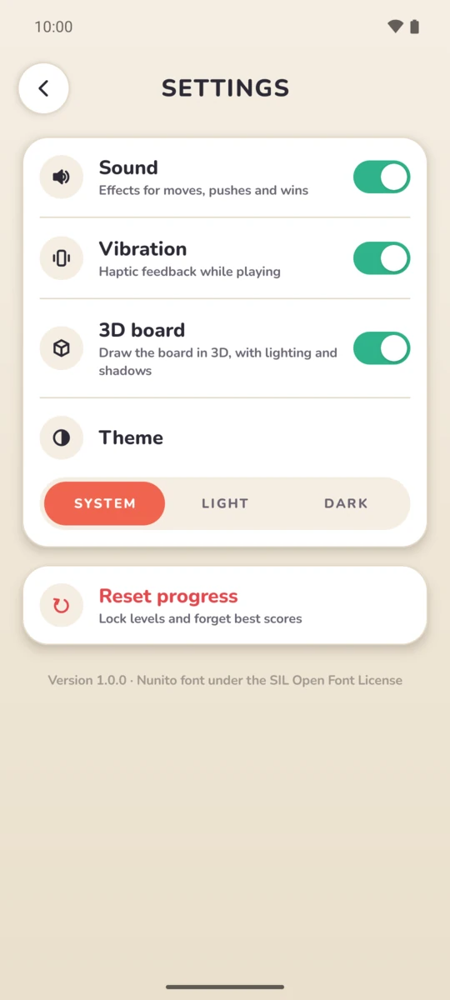 |

On by default, switchable in Settings. `ui/board3d/` draws the same game with
Filament: one board mesh per level, a renderable per crate, target and the
hero, all driven frame by frame by the 2D board's `BoardMotion`, so both
boards animate alike; dust and sparks are the 2D particles projected onto an
overlay. Materials are gltfio's ubershaders, so no material compiler is
needed in the build.

All boards share one Filament engine, which stays alive 30 s after the last
board goes: starting one and compiling its shaders would stall every slide to
a level. Filament needs OpenGL ES 3.0; without it, or should the engine fail
to start, the board is drawn in 2D and the setting is hidden.

Both boards fit a level whole. On big rooms, whose tiles come out small, a
pinch zooms in; the view then follows the hero when it nears an edge, and a
button shows the whole board again.

| Fitted | Pinched in |
|:--:|:--:|
| 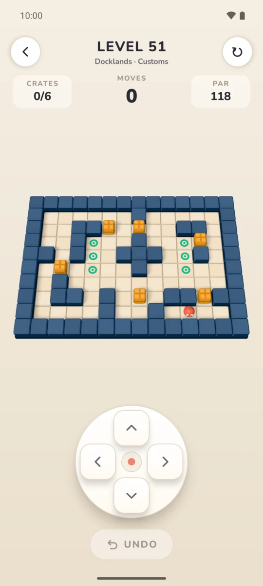 | 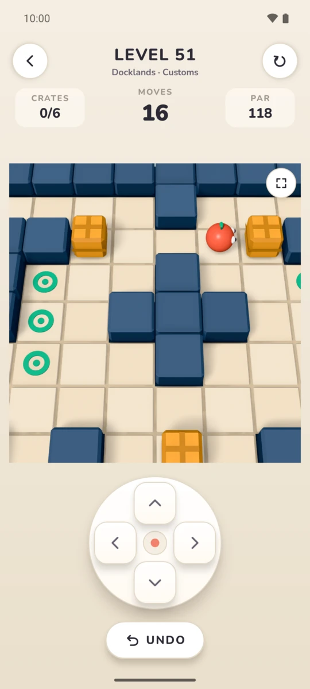 |

## Levels

Levels use the standard text format (`#` wall, `.` goal, `$` box, `@` player,
`*` box on goal, `+` player on goal) and live in
`core/src/main/kotlin/dev/stefan/sokoban/core/levels/`.

Each level has a stored solution in `core/src/test/resources/solutions.txt`.
`LevelPackTest` replays every solution through the engine and re-proves
solvability with the solver, so a broken level fails the build. A level's par
is the length of its stored solution.

A new level also needs its name (and hint, if any) in every
`app/src/main/res/values*/levels.xml` and in `LevelText.kt`; `LevelTextTest`
fails until it has them.

Design tools, run on demand:

```bash
./gradlew :core:test --tests '*LevelWorkbench*' -Psokoban.report=/tmp/report.txt --rerun
./gradlew :core:test --tests '*LevelWorkbench*' -Psokoban.generate=/tmp/rooms.txt --rerun
```

## Languages

English and Khmer. The app follows the device language; on Android 13+ it can
also be switched alone, in Settings › Apps › Sokoban › Language.

The texts are in `app/src/main/res/values*/`: `strings.xml` for the screens,
`levels.xml` for world and level names and tutorial hints (the English copy is
kept identical to `:core` by `LevelTextTest`), and `typography.xml` for what a
script needs changed. Khmer has no capitals, so it drops the letter spacing of
titles and labels, and its taller lines get a taller hint slot. Khmer text is
drawn with the system's Khmer font, as Nunito has no Khmer letters.

<p align="center">
  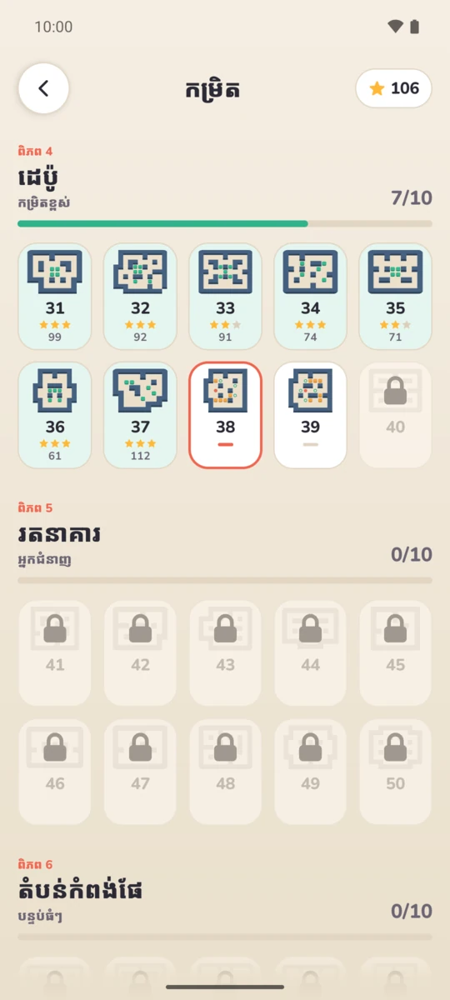
  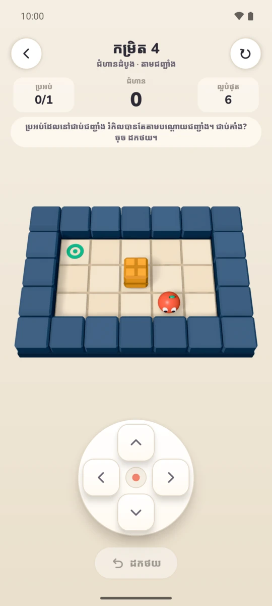
</p>

## Sound

Every effect is synthesised at startup. To replace one with a recording, add a
WAV file named after it to `app/src/main/assets/sounds/` (`button`, `step`,
`push`, `goal`, `bump`, `undo`, `restart`, `star`, `unlock`, `victory`); no
code change is needed.

## Licences

The Nunito font is used under the SIL Open Font License
(`docs/licenses/Nunito-OFL.txt`).
